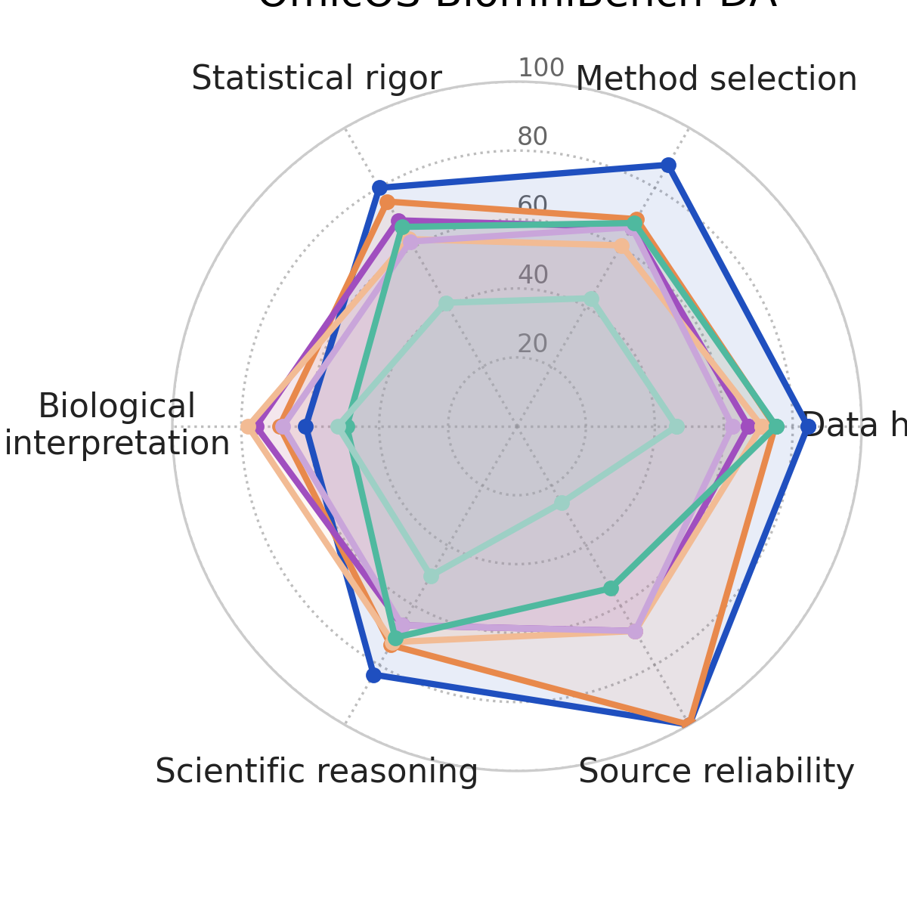
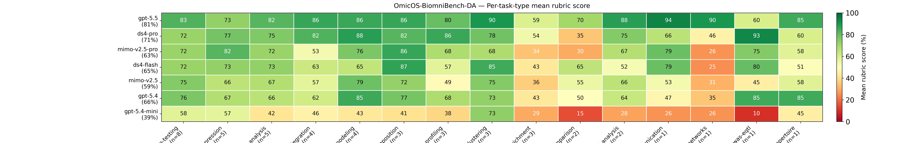

<p align="center">
  
  
  
  
  
</p>

# OmicOS-BiomniBench — agent harness & results

This is the **benchmarking harness for the
[omicos](https://github.com/omicverse/omicos) agent on the
[BiomniBench-DA](https://huggingface.co/datasets/phylobio/BiomniBench-DA)
dataset** (50 process-level biomedical data-analysis tasks derived from
published research papers, graded against expert-authored rubrics).

> **Task spec, fixtures, and rubrics live on HF**:
> [`phylobio/BiomniBench-DA`](https://huggingface.co/datasets/phylobio/BiomniBench-DA).
> This repository hosts only the **harness, sweep configs, per-model
> results, and capability analysis** — it does not duplicate the dataset.

> **`omicos` agent source code**: hosted separately at
> [github.com/omicverse/omicos](https://github.com/omicverse/omicos)
> *(coming soon — public release pending)*. This harness talks to
> `omicos serve` over its public HTTP API; once the omicos repo is up,
> `pip install omicos` (or the local build instructions there) will be
> enough to reproduce.

## What this measures

For each `(agent_id, task)` cell the harness:

1. Copies the BiomniBench-DA task's `environment/` into a per-cell workspace under `runs/<run_id>/<agent_id>/<task_id>/workspace/` and drops `instruction.md` alongside it.
2. Launches `omicos serve` against that workspace with a unique port and the selected agent's `.md` overlaid from the omicos admin catalog.
3. Sends the instruction via `POST /api/agent/chat/stream` with `config.agent = <id>` and streams the SSE response.
4. Persists the **full trajectory** (tool calls + assistant turns) to `trajectory.jsonl`.
5. Grades by reading `<workspace>/trace.md` + `<workspace>/answer.txt` and applying the task's `tests/rubric.txt` — parse per-criterion `Levels: A=X B=Y C=0`, ask the judge LLM to pick A/B/C for each, sum to a 0–100 score, divide by 100.

A cell counts as **passed** when `score >= 0.7`.

## Headline results

**7 models · 50 tasks · capability mean** (excludes 4 documented benchmark-defect tasks and infra-failure cells; see `docs/failure-cases/`):

| Model            | Capability mean | All-50 mean |
|------------------|----------------:|------------:|
| **gpt-5.5**      | **80.7%**       | 78.8%       |
| ds4-pro          | 73.9%           | 73.0%       |
| gpt-5.4          | 68.0%           | 67.7%       |
| ds4-flash        | 67.3%           | 66.0%       |
| mimo-v2.5-pro    | 67.1%           | 65.8%       |
| mimo-v2.5        | 63.7%           | 62.3%       |
| gpt-5.4-mini     | 44.2%           | 44.2%       |

Two of the cheapest models (ds4-flash, mimo-v2.5) are within 6 pp of gpt-5.4 at a fraction of the API cost. See `analysis/omicos_cost_vs_score.png` (static) or [`analysis/omicos_cost_vs_score.html`](analysis/omicos_cost_vs_score.html) (interactive — hover for per-cell numbers, including omicos vs published external harnesses).

### 6-dimension capability profile

`analysis/omicos_radar.png` partitions each task's rubric criteria into the six BiomniBench-DA evaluation dimensions (data handling, method selection, statistical rigor, biological interpretation, scientific reasoning, source reliability) and reports per-dimension percent-of-A-points earned.



*Non-trivial pattern: gpt-5.5 dominates most dimensions (100% source reliability, 88% method selection, 85% reasoning), but is the **weakest on biological_interpretation (60%)**, where ds4-flash (76%), mimo-v2.5-pro (73%), and mimo-v2.5 (68%) actually outperform it. gpt-5.4-mini lags on every axis (~40%) — its source_reliability of 26% reflects nearly absent citation discipline.*

Interactive Plotly version (hover each vertex for the exact percentage, click a legend entry to toggle that model): [`analysis/omicos_radar.html`](analysis/omicos_radar.html) — generated by `scripts/bench_radar_html.py`.

The full 355-criteria → 6-dimension mapping is audit-able in
`analysis/omicos_dim_map.csv`; edit & re-run `scripts/bench_radar.py` to refine.

### Per-task-type breakdown — where each model wins and loses

BiomniBench-DA's 50 tasks span 16 distinct analytical task types
(`task.toml -> [metadata].task_type`). The heatmap below shows each
backend's mean rubric score on every task type — rows sorted by
overall capability mean (best at top), columns by sample size. The
4 documented benchmark-broken tasks (`da-12-4`, `da-18-7`, `da-20-1`,
`da-6-2`; see `docs/failure-cases/`) and infra-failure cells are
excluded from the cell means so values reflect capability, not
plumbing or rubric-versus-question artifacts.



*Patterns visible at a glance:*

- *`pathway-enrichment` is the across-the-board weak axis — every
  backend, including gpt-5.5, scores well below its own overall
  mean here (best is gpt-5.5 at 59).*
- *Within the mid-budget tier (mimo-v2.5-pro, ds4-flash, mimo-v2.5,
  gpt-5.4), per-task-type ranks shuffle: mimo-v2.5-pro leads on
  `differential-expression` (82, beating gpt-5.5's 73); ds4-flash
  leads on `cell-composition` (87); gpt-5.4 leads the mid-tier on
  `predictive-modeling` (85). Picking one backend per task type is
  consistently better than picking one backend for everything.*
- *`co-expression-networks` (n=1) and `cross-cohort-comparison`
  (n=2) are the spots where non-gpt-5.5 backends collapse to the
  20s–30s — sparse-data inference at this size remains a
  capability gap for the cheaper models.*

*Grey "—" cells are types where every available cell was an
infra-failure for that model under the canonical sweep.*

## Failure analysis — every sub-0.7 gpt-5.5 task

For the canonical gpt-5.5 run, 11 of 50 tasks scored below the 0.7 pass
threshold. We read every trajectory + rubric + grader notes and
classified the score gap into three buckets:

- **🟥 Benchmark broken** — gold answer / rubric methodology is itself wrong (statistically incorrect, contradicts the question, or rests on retracted science). Agent's behaviour is defensible. **These four are excluded from the capability mean.**
- **🟧 Rubric strict** — rubric demands a specific methodology not communicated in `instruction.md`; the agent's alternative choice is methodologically defensible. Reasonable people can disagree; we keep these in the capability mean.
- **🟦 Agent gap** — agent genuinely skipped a required step or used a sub-optimal method. This is the real capability ceiling.

| Task | Score | Issue | Bucket |
|---|---:|---|:---:|
| `da-20-4` | 0.28 | Agent ran DE + GSEA but **omitted KRAS_SIGNALING_UP and EMT pathway interpretation entirely** (C4=0, C5=0); also only analyzed the 3000 nM dose instead of all 24 BFA conditions. Skipping the two key Hallmark pathways the question implicitly hinges on is a real omission. | 🟦 Agent gap |
| `da-6-2` | 0.35 | Question asks "**dynamically change** + temporal patterns"; rubric requires *significance at all 4 timepoints* before pattern encoding — that filter discards **86%** of training-responsive genes (every late-onset / transient response), the **opposite** of the question's "dynamic" framing. | 🟥 Benchmark broken |
| `da-20-1` | 0.46 | Question asks "most similar cell-type pair". Agent's analysis (ARI=0.991, perfect clustering) ranks SkMM-Fibroblast and AoSMC-SkMM within **<1%** — a statistical tie. Rubric requires AoSMC-SkMM and cites ACTA2/TAGLN as evidence — but those are smooth-muscle/fibroblast markers, **not skeletal-myoblast markers**. Cited biology contradicts the cited answer. | 🟥 Benchmark broken |
| `da-13-5` | 0.50 | Question: "Do feminizing GAHT-associated proteins overlap with sex-associated proteins?" Agent overlapped the full significant sex-associated set (2606 proteins); rubric demands "top 100 by Sex_log10_p". **Instruction never specifies "top 100"** — that's an arbitrary cutoff the rubric adds. Agent's full-set hypergeometric is statistically sound. | 🟧 Rubric strict |
| `da-24-3` | 0.60 | Multi-trait GWAS shared loci. Agent did inverse-variance meta-analysis + custom coloc → 14 loci → 4 shared. Lost points on (C4) **not checking discovery/replication direction consistency** — that's a real methodological omission — and on (C6/C7) coloc-input details (MAF/sdY) which are method-detail nits. Roughly half agent gap, half rubric. | 🟦 Agent gap (dominant: C4 direction check) |
| `da-18-7` | 0.62 | Question literally says "mutually exclusive **or** co-occurring" (bidirectional). Rubric forces **one-sided** Fisher's exact test, which can only detect mutex — statistically wrong for the question wording. Phantom ESR1-LBD restriction (every observed variant already in 300-550). | 🟥 Benchmark broken |
| `da-13-3` | 0.64 | "Which proteins correlate with body composition" — agent ranked by adjusted p-value; rubric demands ranking by **absolute effect size**. Instruction doesn't specify ranking criterion. Both p-value and effect-size rankings are standard in proteomics. | 🟧 Rubric strict |
| `da-19-4` | 0.65 | Question: "Which genomic regions show reduced H3K27ac upon AI-10-49 treatment?" Agent did a clean genome-wide DE on H3K27ac peaks (9048 reduced regions). Rubric requires specific **MYC ME1/ME2/BDME enhancer** analysis using RUNX1 ChIP-seq anchors — agent missed that the task's leukemia-context implied a MYC-locus focus, not just genome-wide. | 🟦 Agent gap (missed MYC-specific call) |
| `da-17-3` | 0.65 | SLE classical-monocyte DE. Agent used pseudobulk OLS on log-CPM; rubric demands count-based DESeq2/edgeR + `|log2FC|>0.5` threshold. **Instruction doesn't specify methodology or threshold.** Both pseudobulk-OLS and count-based DE are defensible; both filter conventions are common. | 🟧 Rubric strict |
| `da-20-3` | 0.68 | "Which Hallmark pathways are suppressed by BFA?" — agent used pre-ranked GSEA with **signed z-score** ranking; rubric demands ranking by **log2FoldChange directly**. Instruction doesn't specify. Both ranking metrics are mainstream GSEA conventions. | 🟧 Rubric strict |
| `da-8-3` | 0.68 | Spiker classification has two issues: (i) rubric prescribes `peak-glucose-delta + median-split` but instruction provides no definition — agent's `positive iAUC` choice is defensible; **rubric-strict on C1**. (ii) Agent **completely skipped the phenotype-correlation analysis** (against SSPG / Hepatic IR / DI / IE) that the instruction explicitly asks for ("determine which lipid species *statistically mediate*...") — **agent gap on C4 (0/15)**, which is the dominant score loss. | 🟦 Agent gap (dominant: C4 correlation skipped) |

**Summary of the 11 sub-0.7 tasks**:

- **🟥 Benchmark broken: 3** (da-6-2, da-20-1, da-18-7) — plus `da-12-4` which has the same broken-benchmark issue but happens to score 0.86 because the canonical run follows the broken recipe. **Total excluded from capability mean: 4.**
- **🟧 Rubric strict (defensible disagreement): 4** (da-13-5, da-13-3, da-17-3, da-20-3) — kept in capability mean
- **🟦 Agent gap (real ceiling): 4** (da-20-4, da-24-3, da-19-4, da-8-3) — kept in capability mean, these are the score-relevant places to improve next

**Interpretation**: roughly half the score loss in the sub-0.7 tier comes from rubric over-specification (the rubric prescribes a particular methodology that the instruction never communicates), and roughly half comes from genuine agent shortcomings. The single biggest agent-side pattern is **skipping a required sub-step** (da-19-4 missed MYC-locus analysis, da-8-3 missed phenotype correlation, da-20-4 missed two Hallmark pathway interpretations, da-24-3 missed direction-consistency check). That's the same failure mode each time — the agent runs the primary analysis competently but skips one of the secondary analyses the question implicitly requires.

Per-task case studies for the 4 broken-benchmark cases live in
[`docs/failure-cases/`](docs/failure-cases/); each has the full
trajectory + rubric + side-by-side citation.

## Quick start

```bash
# 0. Environment + secrets
cp bench-env.template.sh bench-env.sh   # then $EDITOR; fill DEEPSEEK_API_KEY / HF_TOKEN etc.
source bench-env.sh

# 1. Install omicos  (https://github.com/omicverse/omicos — coming soon)
# Once public:
pip install omicos
# Or local build per the omicos repo's instructions.

# 2. Fetch the BiomniBench-DA dataset (gated on HF; accept terms first)
uv run omicos-biomnibench fetch

# 3. Run all 50 tasks under one model (provider, model-id, result label)
bash scripts/bench_model.sh deepseek deepseek-v4-pro ds4-pro
bash scripts/bench_model.sh codex    gpt-5.5         gpt-5.5

# 4. Compare two or more finished runs
python3 scripts/bench_compare.py gpt-5.5 ds4-pro ds4-flash

# 5. (Optional) Cost analysis + 6-dim radar
python3 scripts/bench_cost.py        gpt-5.5 ds4-pro ds4-flash
python3 scripts/bench_cost_chart.py  gpt-5.5 ds4-pro ds4-flash
python3 scripts/bench_radar.py
```

## Repo layout

```
OmicOS-BiomniBench/
├── README.md                       this file
├── LICENSE                         PolyForm Noncommercial 1.0.0
├── pyproject.toml
├── Makefile
├── bench-env.template.sh           env template — fill in & source
├── .gitignore
│
├── src/omicos_biomnibench/         harness Python package
│   ├── cli.py                          fetch / smoke / run / regrade / report entry
│   ├── runner.py                       spawn `omicos serve` per task, manage lifecycle
│   ├── client.py                       SSE client, full-trajectory capture
│   ├── grader.py                       rubric judge (DeepSeek v4-pro by default)
│   ├── matrix.py                       agent × task orchestrator
│   ├── dataset.py                      HF snapshot_download, per-task staging
│   └── __init__.py
│
├── configs/
│   ├── agents.yaml                     which omicos agents to evaluate
│   └── models.yaml                     agent backend + judge backend config
│
├── scripts/
│   ├── bench_model.sh                  run all 50 tasks under one model (namespaced run)
│   ├── bench_compare.py                aggregate / compare runs; find + fix infra failures
│   ├── bench_cost.py                   naive + cache-adjusted cost per task
│   ├── bench_cost_chart.py             cost-vs-score scatter (omicos vs. other harnesses)
│   └── bench_radar.py                  6-dim capability radar generator
│
├── results/                        per-model graded outputs (50 tasks × 7 models)
│   ├── gpt-5.5/        vertical_agent_selector/da-*/grade.json
│   ├── ds4-pro/        vertical_agent_selector/da-*/grade.json
│   ├── ds4-flash/      vertical_agent_selector/da-*/grade.json
│   ├── gpt-5.4/        vertical_agent_selector/da-*/grade.json
│   ├── gpt-5.4-mini/   vertical_agent_selector/da-*/grade.json
│   ├── mimo-v2.5/      vertical_agent_selector/da-*/grade.json
│   └── mimo-v2.5-pro/  vertical_agent_selector/da-*/grade.json
│
├── analysis/                       capability profile + cost-vs-score chart
│   ├── omicos_radar.png                7-model × 6-dim radar (headline figure)
│   ├── omicos_dim_map.csv              criterion → dimension audit (355 rows)
│   └── omicos_cost_vs_score.png        cost-adjusted comparison chart
│
└── docs/
    ├── model-benchmarking.md           full sweep / compare / regrade workflow
    ├── grading-deviations.md           judge-swap deviation log
    └── failure-cases/                  per-task benchmark-defect case studies (4 docs)
```

## What's NOT in this repo

| Artifact | Where |
|---|---|
| Task instructions, fixtures, rubric.txt, oracle/ | HF [`phylobio/BiomniBench-DA`](https://huggingface.co/datasets/phylobio/BiomniBench-DA) |
| `omicos` agent runtime source code | [github.com/omicverse/omicos](https://github.com/omicverse/omicos) *(public release pending)* |
| Trajectory JSONs (~5 GB across all runs) | Regenerate by re-running `scripts/bench_model.sh`. The judge is deterministic given a fixed trajectory, so re-grading reproduces `results/<run>/.../grade.json` row-for-row. If we later need to share traces for qualitative review, they may land at `omicverse/OmicOS-BiomniBench-trajectories` on HF. |

## Methodology highlights

- **Two-source rubric layout.** Each task has its own `tests/rubric.txt` shipped with the HF dataset. Criteria look like `Criterion 3: Title \n Description: ...\n Levels: A=18 B=8 C=0 \n [A]: ...`. The grader parses these, sends the agent's `trace.md` + `answer.txt` to the judge, and asks for an A/B/C per criterion.
- **Judge default**: DeepSeek v4-pro (`OmicBench` uses the same). Fallback chain: `(configured → anthropic → gemini → deepseek)`. Swap with `OMICOS_BENCH_JUDGE_MODEL`.
- **Failure cases.** Four tasks are documented as *benchmark defects* in `docs/failure-cases/`: a gold answer that rests on a retracted paper + contaminant genus (da-12-4), a rubric that forces a one-sided test for an explicitly bidirectional question (da-18-7), a rubric that prescribes a methodology contradicting the question's open framing (da-6-2), and a "most similar pair" that is a statistical tie with a biologically-wrong gold answer (da-20-1). The headline `Capability mean` excludes them; the `All-50 mean` includes them so the unfiltered score is still visible.
- **Infra failures** (`no_output / error / serve_failed / judge_unavailable`) are excluded from both means and flagged separately by `scripts/bench_compare.py --infra <label>`.

See `docs/model-benchmarking.md` for the full reproducibility recipe.

## Citation

```bibtex
@misc{omicos-biomnibench-2026,
  title  = {OmicOS-BiomniBench: evaluating an omics agent on BiomniBench-DA},
  author = {OmicVerse contributors},
  year   = {2026},
  url    = {https://github.com/omicverse/OmicOS-BiomniBench}
}
```

If you use this benchmark, please also cite the upstream BiomniBench paper (see the HF dataset card for the canonical citation).

## License

This repository is released under the
[**PolyForm Noncommercial License 1.0.0**](https://polyformproject.org/licenses/noncommercial/1.0.0/).
Academic research, personal study, and any other **noncommercial** use is
freely permitted. Commercial use requires a separate license — contact
the maintainers.

The `omicos` agent runtime referenced here is hosted in a separate
repository ([github.com/omicverse/omicos](https://github.com/omicverse/omicos)),
under its own license.

BiomniBench-DA task specs / rubrics / fixtures on HF are subject to
their dataset card terms (see the HF page).
